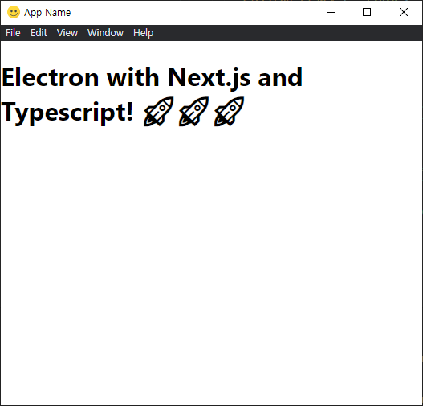
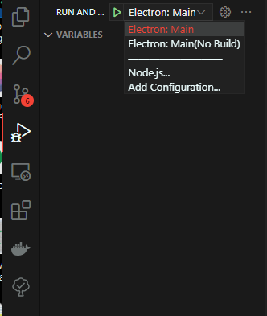
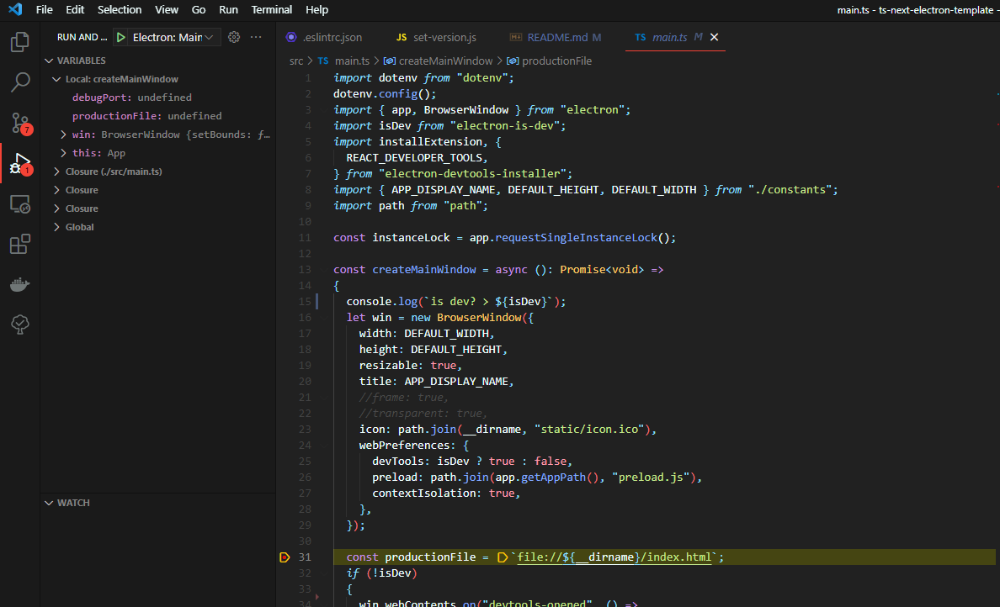
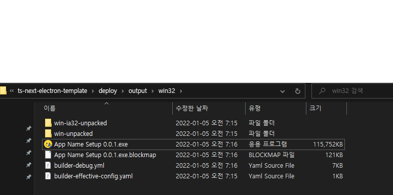
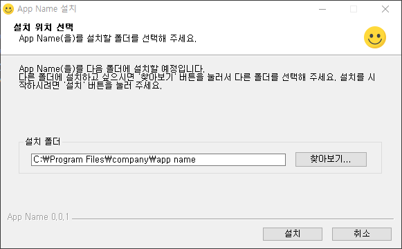

# TS-NEXT-ELECTRON-TEMPLATE 🚀

This project is the boilerplate of [Electron](https://www.electronjs.org/) with [Next.js](https://nextjs.org/) and [Typescript](https://www.typescriptlang.org/).

You can start developing Electron app with Next.js and Typescript easliy 😃!

1. [Quick Start](#first)
2. [VS code debug for Electron](#second)
3. [How to package app](#third)

---

<a id="first"></a>

## 1. Quick Start

Just follow the steps below:

1. clone this repo with [degit](https://github.com/Rich-Harris/degit)(you can use just git clone)

```bash
$ npx degit https://github.com/walrus811/ts-next-electron-template.git my_app
```

2. move `my_app` directory and init git repo

```bash
$ cd my_app
$ git init
```

3. install the packages for Electron and Next

```bash
$ yarn
$ yarn i:env # init .env for dotenv
$ cd next
$ yarn
```

4. set app name and version

```bash
$ cd ..
$ pwd
app/my_app

$ yarn set:name my_app
name is changed to my_app

$ yarn set:vversion 0.0.1
version is bumped up to 0.0.1
```

5. run Next and Electron with development mode

```bash
$ cd next
$ pwd
app/my_app/next

$ yarn dev
ready - started server on 0.0.0.0:3000, url: http://localhost:3000
event - compiled client and server successfully in 2.3s (171 modules)
wait  - compiling / (client and server)...
event - compiled client and server successfully in 173 ms (174 modules)

$ cd ..
$ pwd
app/my_app

$ yarn bx:dev
```

6. You can see the app launched below & happy hacking!



---

<a id="second"></a>

## 2. VS code debug for Electron

There's already debug setting for Electorn, so you just press F5(in Windows)!

Two debug modes are available.

1. Electron: Main : Run debugger after build source files.
2. Electron: Main(No Build) : Run Debugger only

If you want to debug only without changing source files, It's the good option to use second one. It's faster than first because it just uses old build files.





---

<a id="third"></a>

## 3. How to package app

This boilerplate uses [electron-builder](https://www.electron.build/) for packaging.

### Win32

1. build the source file for production

```bash
$ pwd
app/my_app

$ yarn b:prod
```

2. edit build script for win32

> you can find all options in [electron-builder docs](https://www.electron.build/)

- /deploy/scripts/win32/build-win32.yml
- /deploy/scripts/win32/nsis_script.nsh

3. package the app

```bash
$ yarn d:win32
```

4. you can find the output in `/deploy/output/win32`





### Darwin(OS X, as DMG)

1. build the source file for production

```bash
$ pwd
app/my_app

$ yarn b:prod
```

2. edit build script for darwin

> you can find all options in [electron-builder docs](https://www.electron.build/)

- /deploy/scripts/darwin/build-darwin.yml

3. package the app

```bash
$ yarn d:darwin
```

4. you can find the output in `/deploy/output/darwin`
